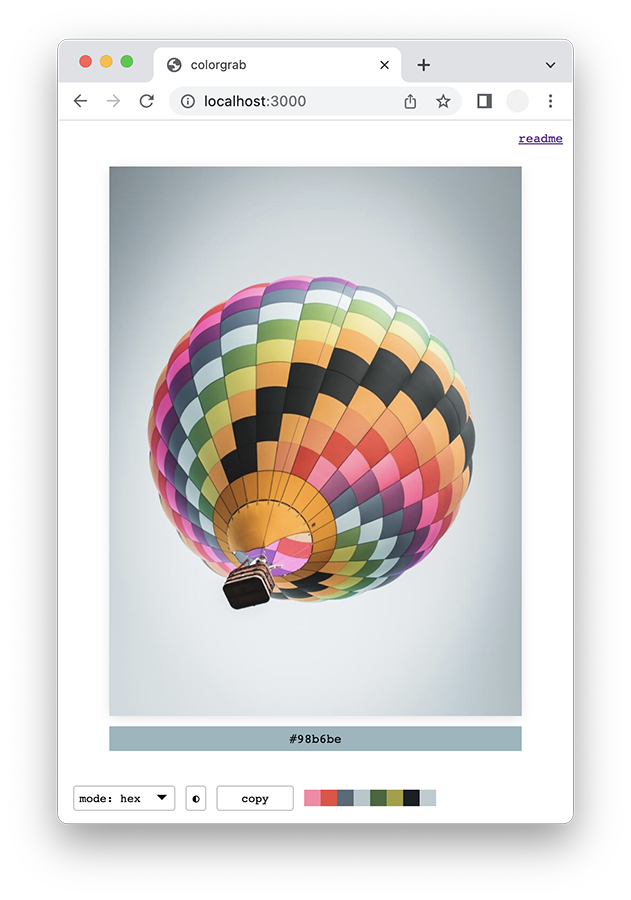

# colorgrab

A small open source tool to pick colors from an image. Features:

- Drag + Drop Images or load from URL
- Minimal interface and eyedropper
- Copy-to-clipboard on click
- Copy all swatches as JSON
- Various output formats: `hex, srgb, lab, lch, oklch`

Currently desktop only.

## demo

https://mattdesl.github.io/colorgrab

## To use

Open [the app](https://mattdesl.github.io/colorgrab) and click around on the loaded image to build up a palette. Each time you click, the color is added to a palette and its color code saved to clipboard.

Click the "copy" button to copy the whole palette as JSON, or click individual swatches to copy their color codes.

Click the small half-circle to load an image from a URL, or just drag and drop a new JPG or PNG onto the page to load it.

To delete a swatch, Shift + Click it.

## credits

Photo by Gonz DDL on Unsplash:
https://unsplash.com/photos/nO2sfLUaxgg

Thanks to [Colorjs.io](https://colorjs.io/) for color functions.
